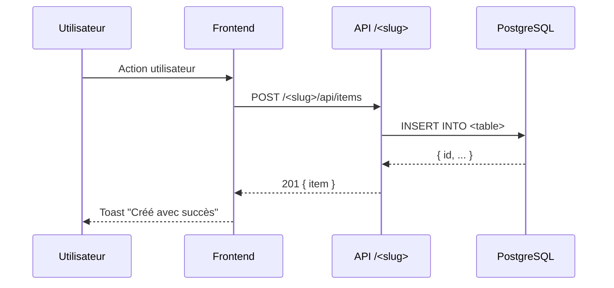
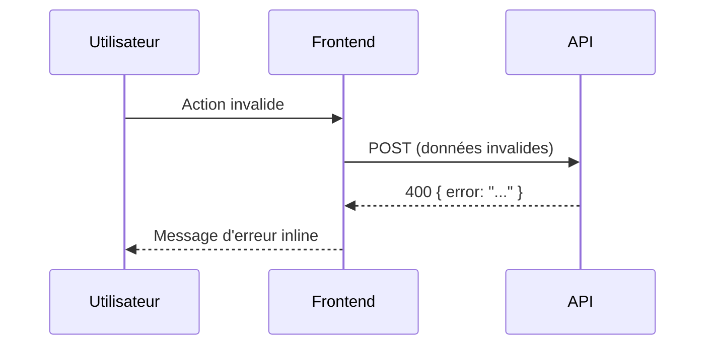

# /spec:propose

Génère une spec complète pour une feature ou modification. Montre TOUT dans le chat avant de créer quoi que ce soit.

**Input** : Description de ce qui doit être construit.

---

## Règles OBLIGATOIRES

### 0. Langue : Français
Tous les artifacts (proposal.md, design.md, tasks.md, progress.md) sont en **français**.
Seuls le code, les chemins, les types TypeScript, les endpoints API et les noms de branches restent en anglais.

### A. Double confirmation avant création de fichiers
1. Présenter le plan complet dans le chat
2. Attendre confirmation explicite ("ok", "go", "c'est bon", "crée les fichiers", etc.)
3. SEULEMENT ALORS créer la branche et écrire les fichiers

### B. Diagrammes Mermaid obligatoires
La section Design DOIT inclure au moins **1 diagramme `sequenceDiagram`**.
Si nouveaux tables SQL → **1 diagramme `erDiagram`** obligatoire.

### C. Plan Mode : adaptation automatique
- **Si Plan Mode actif** : écrire le plan dans le fichier de plan → appeler `ExitPlanMode` → puis montrer dans le chat et créer les fichiers
- **Si Plan Mode inactif** : présenter directement dans le chat → confirmation → fichiers

---

## Étapes

### 1. Recueillir et valider la description

Si l'input est trop vague, demander :
> "Que veux-tu construire ? Module complet, feature sur un module existant, ou modification ?"

Dériver un **slug kebab-case** depuis la description :
- "ajouter la page profil" → `add-profile-page`
- "module gestion de congés" → `module-conges`
- "fix du bug de pagination" → `fix-pagination`

Vérifier que `plans/<slug>/` n'existe pas déjà. Si oui :
> "Un plan `<slug>` existe déjà dans `plans/`. Continuer dessus avec `/spec:apply <slug>` ?"

### 2. Exploration du codebase

Lancer des agents **Explore** pour comprendre le contexte :

```bash
# Lire les règles et patterns du projet
cat CLAUDE.md

# Lister les modules existants (front + back)
ls apps/platform/src/modules/
ls apps/platform/servers/unified/src/modules/

# Plans existants pour référence de format
ls plans/ 2>/dev/null

# Module similaire comme référence (si pertinent)
# cat apps/platform/src/modules/<module-similaire>/types/index.ts
```

Identifier :
- Patterns et composants réutilisables
- Structure d'un module similaire
- Contraintes techniques (auth, design system, etc.)

### 3. Construire et présenter le plan

Afficher dans le chat (ou écrire dans le plan file si Plan Mode actif) :

---

```
## 📋 Spec : <Titre lisible>

**Slug** : `<slug>` | **Branche** : `feat/<slug>` | **Type** : feature | fix | refactor

---

## Proposal

### Pourquoi
<Problème résolu ou opportunité. 2-4 phrases. Contexte métier.>

### Ce qui change
- <Changement 1>
- <Changement 2>

### Capacités
#### Nouvelles
- `<capability-slug>` : <description en une ligne>

#### Modifiées (si applicable)
- `<module>/<feature>` : <ce qui change>

### Existant à réutiliser
| Élément | Fichier | Pourquoi réutiliser |
|---------|---------|---------------------|
| Layout, ModuleHeader | @boilerplate/shared | Design system |
| useGatewayAuth | @boilerplate/shared | Auth |
| <autre> | <chemin> | <raison> |

### Scope — fichiers à créer
| Fichier | Description |
|---------|-------------|
| apps/platform/src/modules/<slug>/App.tsx | Composant principal |
| ... | ... |

### Scope — fichiers à modifier
| Fichier | Modification |
|---------|--------------|
| apps/platform/src/router.tsx | Ajouter route /<slug> |
| ... | ... |

### Hors scope
| Élément | Raison |
|---------|--------|
| <feature exclue> | <pourquoi pas maintenant> |

### Critères d'acceptation
1. <Critère vérifiable 1>
2. <Critère vérifiable 2>

---

## Design

### Contexte technique
<Modules existants pertinents, patterns utilisés dans ce projet, contraintes>

### Décisions
1. **<Décision 1>** : <Justification>
2. **<Décision 2>** : <Justification>

### Contrats API
| Méthode | Chemin | Auth | Description |
|---------|--------|------|-------------|
| GET | /<slug>/api/items | ✓ | Liste les items |
| POST | /<slug>/api/items | ✓ | Crée un item |
| PUT | /<slug>/api/items/:id | ✓ | Met à jour |
| DELETE | /<slug>/api/items/:id | ✓ | Supprime |

### Payloads (TypeScript)
```typescript
interface <Entity> {
  id: number;
  // ...
  createdAt: string;
  updatedAt: string;
}

interface Create<Entity>Request {
  // ...
}
```

### Flux : <Action principale>


### Flux : Cas d'erreur


### Modèle de données (si nouveaux tables)
```mermaid
erDiagram
    <TABLE> {
        serial id PK
        integer user_id FK
        varchar name
        timestamp created_at
        timestamp updated_at
    }
    users ||--o{ <TABLE> : "possède"
```

---

## Tâches (<N> tâches)

### 1. Base de données
- [ ] 1.1 Créer `database/init/XX_<slug>_schema.sql`

### 2. Backend — Module
- [ ] 2.1 Créer `apps/platform/servers/unified/src/modules/<slug>/index.ts`
- [ ] 2.2 Créer `routes.ts` avec les handlers Express
- [ ] 2.3 Créer `dbService.ts` avec les requêtes SQL
- [ ] 2.4 Monter le module dans `apps/platform/servers/unified/src/index.ts`

### 3. Frontend — Module
- [ ] 3.1 Créer `apps/platform/src/modules/<slug>/App.tsx`
- [ ] 3.2 Créer `types/index.ts`
- [ ] 3.3 Créer `services/api.ts`
- [ ] 3.4 Créer les composants UI

### 4. Configuration
- [ ] 4.1 Ajouter la route dans `apps/platform/src/router.tsx`
- [ ] 4.2 Ajouter le proxy dans `apps/platform/vite.config.ts`
- [ ] 4.3 Ajouter l'app dans `SharedNav/constants.ts`
- [ ] 4.4 Ajouter dans `AVAILABLE_APPS` dans `gateway.ts`

### 5. Tests
- [ ] 5.1 Créer `apps/platform/servers/unified/src/modules/__tests__/<slug>/<slug>.test.ts`
- [ ] 5.2 Créer `apps/platform/src/modules/<slug>/__tests__/<slug>.test.ts`
- [ ] 5.3 Ajouter projets dans `vitest.config.ts`
- [ ] 5.4 Ajouter scripts dans `package.json`
- [ ] 5.5 Lancer `npm test` — tous les tests doivent passer

---

*Confirme pour créer les fichiers dans `plans/<slug>/` et la branche `feat/<slug>`.*
```

---

### 4. Si Plan Mode actif

Appeler `ExitPlanMode` après avoir écrit le plan file.
Après approbation de l'utilisateur : afficher le résumé du plan dans le chat (reprendre les sections clés), puis créer les fichiers.

### 5. Création des artifacts (après confirmation)

**5.1 Branche**
```bash
CURRENT=$(git branch --show-current)
if [ "$CURRENT" = "main" ]; then
  git checkout -b feat/<slug>
fi
```

**5.2 Répertoire**
```bash
mkdir -p plans/<slug>/specs
```

**5.3 Fichiers** — extraire les sections du plan pour les écrire :

- `plans/<slug>/proposal.md` — sections Pourquoi → Critères d'acceptation
- `plans/<slug>/design.md` — sections Contexte → Modèle de données (avec diagrammes Mermaid)
- `plans/<slug>/tasks.md` — section Tâches complète
- `plans/<slug>/progress.md` — initialiser avec les métadonnées

**Format de progress.md** :
```markdown
# Progress: <slug>

## Metadata
- Type: feature | fix | refactor
- Branch: feat/<slug>
- Parent Branch: main
- Started: <ISO8601>
- Current Phase: proposal
- Status: pending

## Phases
- [x] Proposal (<date>)
- [ ] Implementation
- [ ] Verification
- [ ] Testing
- [ ] Archive

## Historique
- <ISO8601>: Change créé via /spec:propose
```

### 6. Résumé final

```
## ✅ Plan créé : <slug>

**Branche** : feat/<slug>
**Répertoire** : plans/<slug>/

### Fichiers créés
- proposal.md — Pourquoi et quoi
- design.md — Architecture + N diagrammes Mermaid
- tasks.md — N tâches en M sections
- progress.md — Phase : proposal → prêt pour implémentation

Implémente avec `/spec:apply` ou `/spec:apply <slug>`.
```

---

## Guardrails

- NE PAS créer de fichiers avant confirmation explicite
- NE PAS commencer sur `main` si des modifications de code sont impliquées
- Si `plans/<slug>/` existe déjà → rediriger vers `/spec:apply`
- Les diagrammes Mermaid DOIVENT apparaître dans le chat (pas seulement dans les fichiers)
- Inclure systématiquement une tâche "npm test" dans tasks.md
- Ne pas sur-ingénier : les tâches doivent être spécifiques et actionnables
