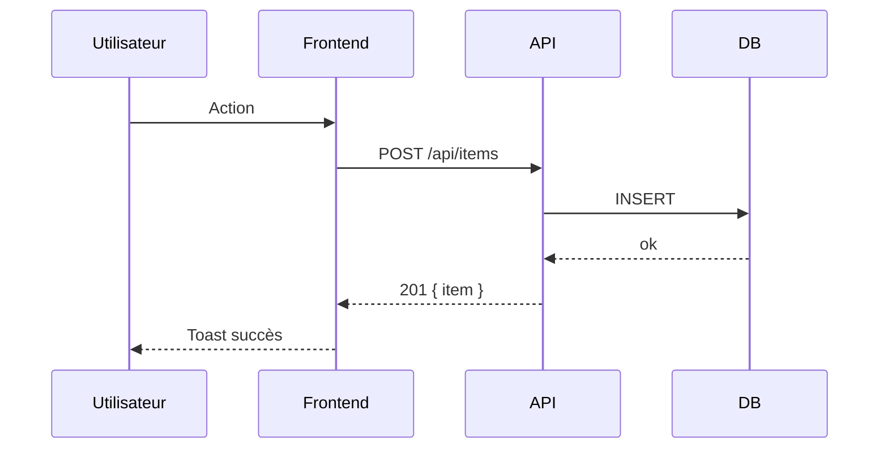
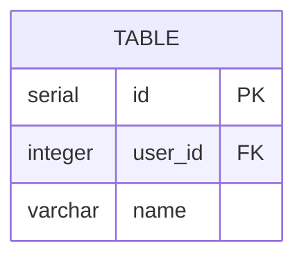

# /spec:propose

Génère une spec complète et la montre dans le chat avant de créer quoi que ce soit.

**Input** : Description de ce qui doit être construit.

---

## Règles

- Tout en **français** (code/chemins/branches en anglais)
- Au moins **1 diagramme `sequenceDiagram`** Mermaid obligatoire
- **ERD** si nouveaux tables SQL
- Créer les fichiers seulement après confirmation explicite ("ok", "go", "c'est bon")
- Si `plans/<slug>/` existe déjà → rediriger vers `/spec:apply <slug>`

---

## Étapes

### 1. Dériver le slug

Depuis la description → slug kebab-case (`"ajouter profil utilisateur"` → `add-user-profile`).

### 2. Explorer le codebase

Lancer des agents Explore pour comprendre le contexte :
- Modules existants similaires
- Patterns réutilisables (composants, hooks, routes backend)
- Contraintes du CLAUDE.md

### 3. Afficher dans le chat

Montrer l'intégralité du plan formaté :

```
## 📋 Spec : <Titre>

**Slug** : `<slug>` | **Branche** : `feat/<slug>`

---

## Proposal

### Pourquoi
<problème résolu ou opportunité>

### Ce qui change
- ...

### Capacités
- `<capability>` : <description>

### Scope
| Fichier | Description |
|---------|-------------|
| ... | ... |

### Critères d'acceptation
1. ...

---

## Design

### Décisions
1. **<décision>** : <justification>

### Contrats API
| Méthode | Chemin | Description |
|---------|--------|-------------|
| GET | /<slug>/api/items | Liste |
| POST | /<slug>/api/items | Crée |

### Flux principal


### Modèle de données (si nouveaux tables)


---

## Tâches

- [ ] 1. Schéma SQL
- [ ] 2. Backend — routes + dbService
- [ ] 3. Frontend — App.tsx + composants + api.ts
- [ ] 4. Configuration (router.tsx, vite.config.ts, SharedNav, gateway.ts)
- [ ] 5. Tests unitaires + `npm test`

---

*Confirme pour créer les fichiers dans `plans/<slug>/` et la branche `feat/<slug>`.*
```

### 4. Après confirmation → créer les fichiers

```bash
git checkout -b feat/<slug>   # si sur main
mkdir -p plans/<slug>
```

Écrire :
- `plans/<slug>/proposal.md`
- `plans/<slug>/design.md` (avec les diagrammes Mermaid)
- `plans/<slug>/tasks.md`
- `plans/<slug>/progress.md` (phase: proposal, status: pending)

### 5. Résumé

```
✅ Plan créé : plans/<slug>/
Branche : feat/<slug>
Lance `/spec:apply` pour implémenter.
```
