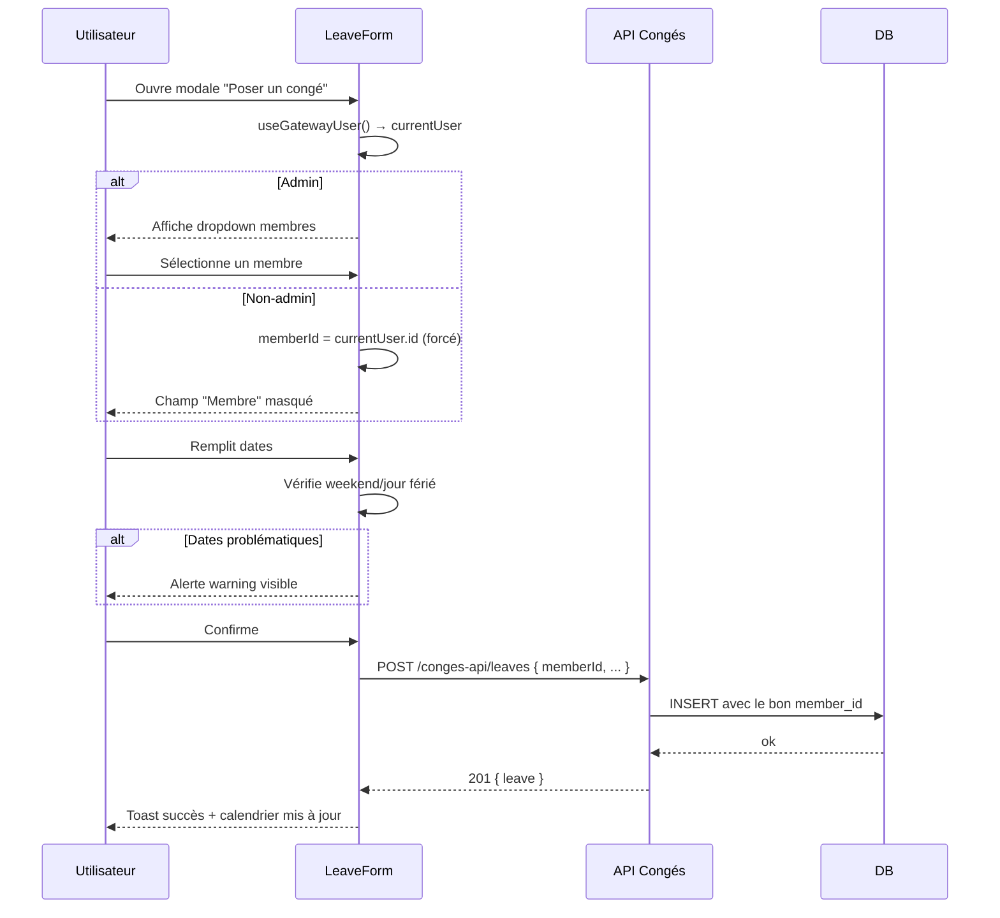
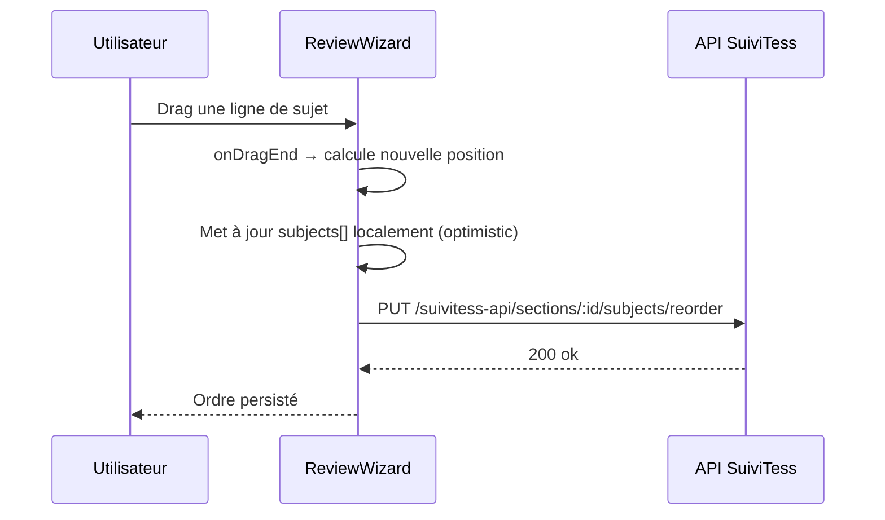
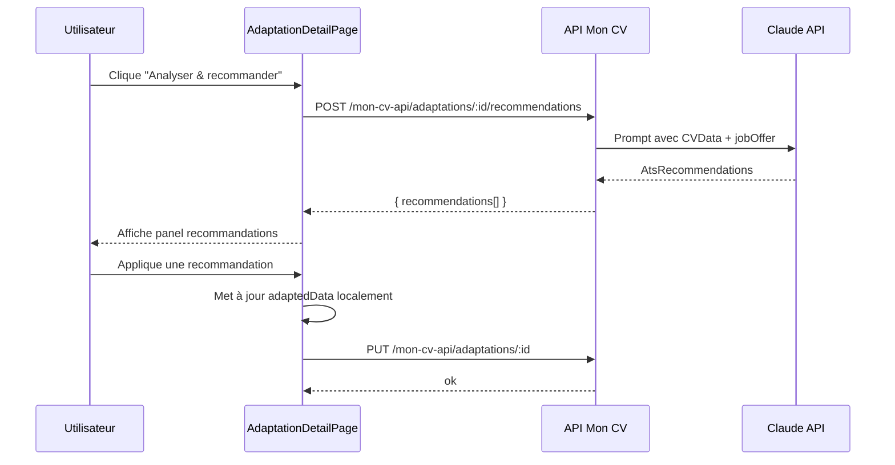

# Design : Corrections Recette Mars 2026

## Décisions techniques

1. **Drag&drop** : utiliser `@dnd-kit/core` si présent, sinon HTML5 drag natif — pas de nouvelle dépendance
2. **Admin dropdown congés** : récupérer `currentUser` via `useGatewayUser()`, si `isAdmin` afficher `<select>` membres, sinon forcer `memberId = currentUser.id`
3. **Puppeteer** : ajouter `executablePath` dynamique avec fallback sur les paths connus de Chrome/Chromium selon l'OS/env
4. **Hauteur textarea** : `useEffect` + `ref` pour auto-resize à chaque changement de valeur
5. **Reorder** : pattern drag&drop avec `onDragEnd` qui appelle l'API puis met à jour l'état local

## Fichiers impactés

| Fichier | Description |
|---------|-------------|
| `conges/components/LeaveForm/LeaveForm.tsx` | Bug membre + admin dropdown + alerte weekend |
| `conges/components/LeaveCalendar/LeaveCalendar.tsx` | Hauteur lignes + largeur filtre année + drag restriction |
| `conges/components/LeaveCalendar/LeaveBar.module.css` | Hauteur lignes CSS |
| `suivitess/components/SubjectReview/SubjectReview.tsx` | Responsable par ligne + pictogrammes |
| `suivitess/components/SubjectReview/SubjectReview.module.css` | Style pictogrammes |
| `suivitess/components/ReviewWizard/ReviewWizard.tsx` | Reorder drag&drop |
| `mon-cv/components/MyProfilePage/MyProfilePage.tsx` | Import photo |
| `mon-cv/components/AdaptCVPage/AdaptCVPage.tsx` | Reorder compétences + hauteur champs + wording |
| `mon-cv/components/AdaptationDetailPage/AdaptationDetailPage.tsx` | Édition manuelle + recommandation IA |
| `mon-cv/components/ProjectEditor/ProjectEditor.tsx` | Reorder projets/technologies |
| `packages/shared/src/styles/theme.css` | Fix accents typographie |
| `apps/platform/servers/unified/src/modules/mon-cv/routes.ts` | Fix Puppeteer chromium path |

## Flux principaux

### Bug membre congés

### Reorder SuiviTess

### Recommandation IA depuis détail adaptation

