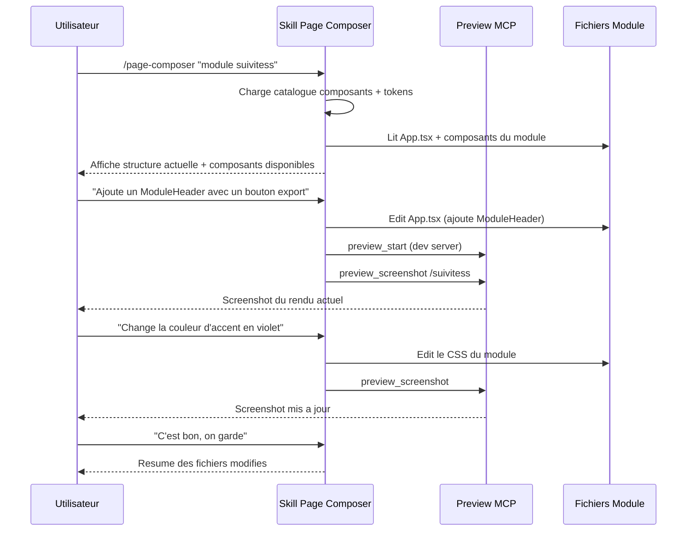

# Design : Skill Page Composer

## Decisions

1. **Skill pur, pas de module** : Pas de backend, pas de base de donnees — juste un fichier `skill.md` qui instruite Claude
2. **Preview MCP comme boucle de feedback** : `preview_start` -> edition -> `preview_screenshot` -> discussion -> iteration
3. **Connaissance embarquee** : Le skill reference directement les composants et tokens du design system dans ses instructions
4. **Modification in-place** : Le skill modifie les fichiers existants des modules (App.tsx, composants, CSS)

## Flux principal



## Architecture du skill

### Fichiers crees

```
.claude/
├── launch.json                          # Config Preview MCP dev server
└── skills/
    └── page-composer/
        └── skill.md                     # Skill principal
```

### Workflow Preview MCP

1. `preview_start` avec le nom "dev-platform" (Vite sur port 5170)
2. Apres chaque edition de fichier : `preview_screenshot` pour capturer le rendu
3. Naviguer vers la route du module cible (`/suivitess`, `/conges`, etc.)
4. Utiliser `preview_inspect` pour verifier les styles CSS appliques
5. Utiliser `preview_eval` pour debug si necessaire

### Catalogue des composants (embarque dans le skill)

| Composant | Import | Props principales |
|-----------|--------|-------------------|
| `Layout` | `@boilerplate/shared/components` | `appId`, `variant` (full-width, centered, sidebar) |
| `ModuleHeader` | `@boilerplate/shared/components` | `title`, `onBack`, children (boutons) |
| `Card` | `@boilerplate/shared/components` | `variant` (default, compact, interactive, selected), `className` |
| `FormField` | `@boilerplate/shared/components` | `label`, `error`, `required`, children |
| `Modal` | `@boilerplate/shared/components` | `title`, `onClose`, children |
| `ConfirmModal` | `@boilerplate/shared/components` | `title`, `message`, `onConfirm`, `onCancel` |
| `Toast/ToastContainer` | `@boilerplate/shared/components` | types: success, error, info, warning |
| `LoadingSpinner` | `@boilerplate/shared/components` | `size` (small, default), `message` |
| `ToggleGroup` | `@boilerplate/shared/components` | `options`, `value`, `onChange` |
| `ListEditor` | `@boilerplate/shared/components` | items array, onAdd, onRemove |
| `TagEditor` | `@boilerplate/shared/components` | tags array, onChange |
| `ExpandableSection` | `@boilerplate/shared/components` | `title`, `badge`, `defaultExpanded` |
| `ImageUploader` | `@boilerplate/shared/components` | `size`, `onChange` |
| `InlineEdit` | `@boilerplate/shared/components` | `value`, `onSave` |
| `MenuDropdown` | `@boilerplate/shared/components` | items with actions |
| `FileDragDropZone` | `@boilerplate/shared/components` | onDrop handler |
| `ScoreBlock` | `@boilerplate/shared/components` | metrics array |
| `ActionCard` | `@boilerplate/shared/components` | title, description, action |

### Tokens CSS (reference)

| Categorie | Exemples |
|-----------|----------|
| Couleurs fond | `--bg-primary`, `--bg-secondary`, `--bg-card` |
| Couleurs texte | `--text-primary`, `--text-secondary`, `--text-muted` |
| Accent | `--accent-primary`, `--accent-hover`, `--accent-bg` |
| Status | `--success`, `--warning`, `--error`, `--info` |
| Spacing | `--spacing-xs` a `--spacing-3xl` |
| Font sizes | `--font-size-xs` a `--font-size-3xl` |
| Radius | `--radius-xs` a `--radius-full` |
| Shadows | `--shadow-xs`, `--shadow-sm`, `--shadow-md` |

### Patterns obligatoires

1. **Layout** : Toujours wrapper avec `<Layout appId="xxx" variant="full-width">`
2. **Header** : Utiliser `<ModuleHeader>` avec classes `module-header-btn-*`
3. **CSS** : Utiliser les tokens CSS (`var(--spacing-md)`) — jamais de valeurs en dur
4. **Prefixe CSS** : Classes globales prefixees avec le nom du module
5. **API service** : Pattern `const API_BASE = '/<module>-api'` + `handleResponse`
