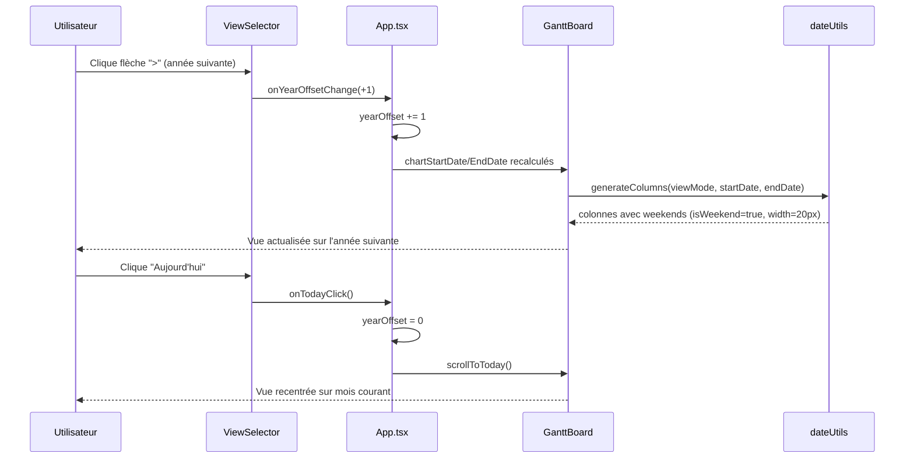
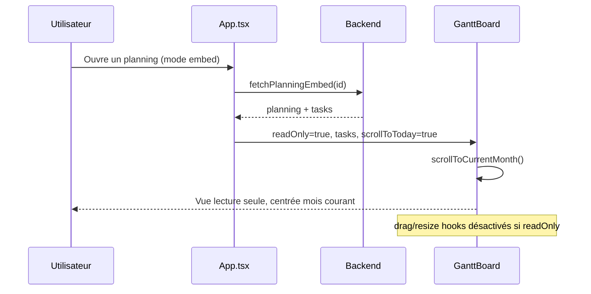

# Design : Roadmap — Corrections & Évolutions Recette Avril 2026

## Décisions

1. **Weekends en vue Mois** : Générer les colonnes weekend avec `isWeekend: true` et `width: 20px` (vs 40px jours ouvrés). Les tâches restent positionnées sur les jours business — `getBusinessDaysBetween()` conservé. Fond CSS `var(--bg-tertiary)`.

2. **Navigation temporelle** : `yearOffset` (state dans App.tsx) + flèches prev/next dans ViewSelector. `chartStartDate/EndDate` tiennent compte de l'offset. CTA "Aujourd'hui" reset offset à 0 et scroll vers today.

3. **Numéros de semaine (vue Trimestre)** : Remplacer la date de début de semaine par `S${getWeekNumber(date)}` selon norme ISO 8601.

4. **Inversion UI parente/sous-tâche** :
   - Avant : parente = transparent + bordure pointillée ; sous-tâche = fond couleur
   - Après : parente = fond plein `task.color`, hauteur 26px ; sous-tâche = transparent, hauteur 18px, `border: 1.5px dashed parentColor`

5. **Mode embed** : `readOnly` prop déjà présent. Conditionner tous les handlers drag/resize à `!readOnly`. Investiguer et corriger le bug d'affichage des sous-tâches en embed.

6. **Couleur auto** : `getNextColor()` déjà en place, vérifier le cycle à la création.

## Flux principal





## Comportement UI tâches

```
AVANT
├── Tâche Parente  [  - - - - - - - - -  ]  fond transparent, bordure pointillée
│   ├── Sous-tâche [████████████]           fond plein couleur, hauteur normale
│   └── Sous-tâche [████]

APRÈS
├── Tâche Parente  [████████████████████]   fond plein couleur, hauteur 26px
│   ├── Sous-tâche [- - - - - - -]          fond transparent, bordure pointillée, hauteur 18px
│   └── Sous-tâche [- - -]
```
